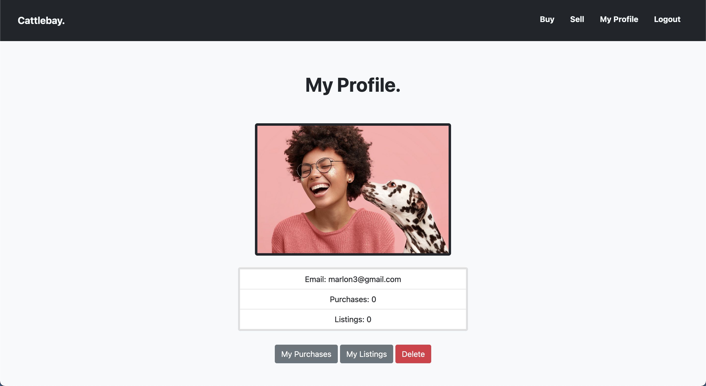
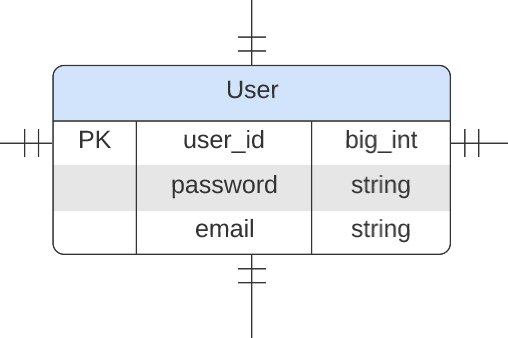
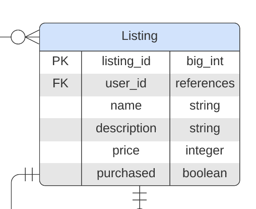

# Marlon Moreira - Cattle-bay Marketplace App

---

## Links

- [Demo video](https://www.linkedin.com/posts/marlonmoreira_mvcframework-activity-6934757941581361152-6v6L/?utm_source=linkedin_share&utm_medium=member_desktop_web)
- [Deployed site](https://whispering-ravine-59863.herokuapp.com/)
- [Source code](https://github.com/marlonmoreira000/cattlebay_app)

---

## Description

This is a mock two-sided online marketplace dedicated to buying and selling Australian Cattle dogs. It was built using Ruby on Rails and deployed on Heroku <3

---

## Purpose

To provide a one-stop-shop for buying and selling Australian Cattle dogs online.

---

## The Problem: Cattle Dogs are hard to find!
Australian Cattle dogs are known for their loyalty and playful nature. As the name suggests, they can be used as working dogs on a farm, but they are also happy to live a life of luxury at home - an ideal pet!

However there is one problem, Cattle dogs can be very difficult to find. They are not often advertised for sale online, and when you do find one for sale, it is often located very far away from your location. 

The Cattle-bay app allows anyone to buy and sell dogs/pups, in one convenient location. 

---

## Why does this problem need solving?
Cattle Dogs are extremely valuable farm dogs. A good mustering dog can do the work of 2-4 men. However, farmers often rely on word-of-mouth or in-person auctions to purchase them. They are family friendly and very loyal. But, as mentioned above, they are notoriously difficult to find online (except for in certain locations/states).

Cattle Dog breeders often rely on word-of-mouth to sell their pups, which can limit their reach. Therefore, it would be good great to have a one-stop-shop to buy and sell these adorable dogs online.

---

## App Description

### a. Purpose

An online marketplace for buying and selling Australian Cattle dogs.

### b. Functionality / Features

- **Accounts:** Anyone can sign up for an account for free by providing a username and email. Once the user has an account they can log in. Once logged in, they can buy and/or sell dogs. Users can also create an account profile which shows their details. They also have the option to delete their account.

- **Listings:** Anyone with an account can create a listing to sell a dog. Each user can see all their listings, as well as which ones have been sold. Users can also edit and/or delete their listings. Users can also search for and sort dogs which might interest them.

- **Image upload:** When creating a listing, users are able to upload a single image of the dog they are hoping to sell. These images are hosted on the Cloudinary CDN.

### c. Sitemap


### d. Screenshots





### e. Target audience

The target audience for this application is anyone looking to buy and/or sell Australian Cattle dogs. For example, this could include farmers looking to find a working dog, or people looking for a new pet.

### f. Tech stack

- **Front-end:** HTML, CSS, SCSS, Ruby (Embedded), Bootstrap 5

- **Back-end:** Ruby on Rails

- **Database:** Postgresql

- **Deployment:** Heroku

- **Project Management Tools:** Trello

- **Authentication:** Devise

- **Authorization:** Rolify, Pundit

- **Wireframes:** Balsamiq

- **Development:** Git, Github, VS Code

---

## User stories

### a. Site Visitor

- As a site visitor, I want to be able to see all current listings so that I can see what's available.
- As a site visitor, I want to be able to create an account so that I can buy and/or sell dogs.
- As a site visitor, I want to be able to log in if i have an account an, so that I can browse for dogs.

### b. Buyers and Sellers

- As a buyer and/or seller, I want to be able to log out so that I can finish my session.
- As a buyer and/or seller, I want to be able to delete my account, in case I no longer use the site.

### c. Buyer only

- As a buyer, I want to be able to purchase dogs.
- As a buyer, I want to be able to see which dogs I've purchased, so that I can keep track of my purchases.

### d. Seller only

- As a seller, I want to be able to create listings in order to sell dogs.
- As a seller, I want to be able to upload an image of each dog, so that other users can see what the dog looks like.
- As a seller, I want to be able to add a description and price for each dog, so that other users can make informed purchases.
- As a seller, I do not want the option to purchase my own dogs.
- As a seller, I want to be able to edit and delete my listings, to keep my information up-to-date.
- As a seller, I want to be able to view all my current listings in one place so that I can keep track of my information.
- As a seller, I want my purchased dogs to be removed from view so other users cannot try and buy them.

---

## Wireframes


---

## Entity Relationship Diagram


---

## App Components

### a. User



The user model represents a single account on the app. A user (account holder) can have roles. If a user makes a purchase, they are given the buyer role. If a user creates a listing, they are given the seller role. It is possible for the user to have both roles at the same time.

The controller for the User model is used to get information from the database relating to the user, and provide it to the view. Some examples of the information it provides are the listings a user has posted, as well as a collection of all their purchases. The views then display this information in the 'My Profile' section of the app.


### b. Role


As discussed above, the role entity represents a user role within the app. There are two roles in this app: buyer and seller. 

In this application, the Role model does not have any associated controller or view. However, the Role model is used for authorization throughout the app in various other controllers.

### c. Listing



The listing entity represents a dog for sale. Users can create listings (i.e. they can put dogs up for sale).

The listings controller is responsible for retrieving all information from the Listing model. It is the most widely used controller in the app, containing a number of actions which perform actions such as getting a collection of all listings in the database, editing a listing of deleting it permanently.
  
### d. Order


The order entity represents an order that a customer makes to purchase a dog. Each order is associated with a single dog (listing) and a single buyer (user).

The Order model is used to maintain records of all orders that are placed on the marketplace. For example, it can be used to get all orders from a particular user.

### e. Picture


The picture entity represents an image of a dog. When a seller creates a listing, they can attach a picture of the dog so that people can see what it looks like.

---

## Third-Party Services


- **Cloudinary:** Cloudinary is the CDN used to host images and videos for the app. The service provides fast, reliable loading of media. In the app, when a user creates a listing, they upload an image of the dog they are trying to sell. This image is then hosted on Cloudinary servers, and retrieved on demand within the app as needed.

- **Bootstrap:** Bootstrap is a CSS framework that provides many pre-built components/styles to use out of the box. Within this app, it was used alongside regular CSS for styling. For example the nav bar and headings were al styled with Bootstrap, and the flex-box-style responsiveness on the listing page was created using the Bootstrap grid system (which is built on flex-box!).

- **Heroku:** Heroku is a cloud Platform as a Service (PaaS) used to host applications online, for the whole world to access. It containerises applications, to maximise the chances that they will run correctly. This app is hosted on Heroku in an isolated virtual environment. A link is provided (see the top of this README!) for anyone around the world to use the app.

---

## Model Relationships/Associations

### a. Relationships

A user `has_many` listings, a listing `belongs_to` a user.

A user `has_many` orders, an order `belongs_to` a user.

A user `has_one` profile, a profile `belongs_to` a user.

A user `has_many` roles `through` user_roles, a role `has_many` users `through` user_roles.

An listing `has_one` order, an order `belongs_to` an listing.

A picture `belongs_to` a listing, a listing `has_one_attached` a picture.

### b. Active Record Associations


#### User
```ruby
class User < ApplicationRecord
    has_one :profile, dependent: :destroy
    has_many :listings, dependent: :destroy
    has_many :orders, dependent: :destroy
end
```

#### UserRole (join table)
```ruby
class UserRole < ApplicationRecord
    belongs_to :user
    belongs_to :role
end
```

#### Role
```ruby
class Role < ApplicationRecord
    has_many :users, through: :user_roles
end
```

#### Listing
```ruby
class Listing < ApplicationRecord
    belongs_to :user
    has_one_attached :picture
    has_one :order
end
```

#### Order
```ruby
class Order < ApplicationRecord
    belongs_to :user
    belongs_to :listing
end
```

#### Picture
```ruby
class Picture < ApplicationRecord
    belongs_to :listing
end
```

#### Profile
```ruby
class Profile < ApplicationRecord
  belongs_to :user
end
```

---

## Database Relations

**Note:** Please refer to ERD above during the following discussion.

### a. User and Listing

A single user can have zero-to-many listings, whereas each listing (dog) can only be added by one user. A listing must be added by a user (you cannot have a listing randomly appearing on the site). So we see that a single listing is associated with one-and-only-one user.

### b. User and Order

A user does not have to make any orders if they don't want to. But, if they do, they can make as many as they like. And a single order must be made by a user (otherwise, who is making the order!?). But an order cannot be made by more than one user (in this app).

### c. User and Role

A user can have roles in this application: buyer and/or seller. But a user does not need to have a role, if they don't buy or sell. A user can have multiple roles, if they buy and sell. So we see that a user can have zero-to-many roles. A role can be attached to many users (e.g. if there are many sellers). But, technically, a role doe not need to be attached to any user. It is possible that there are no buyers or sellers on this marketplace. In this situation, no user would have a role. So we see that a role can be associated with zero-to-many users. To achieve this relationship between user and role, I've used a join table, `UserRole` (See ERD).

### d. UserRole (join table)

As mentioned above, this model (table) is used to create a many-to-many relationship between user and role. In it, we can have one user id associated with many role ids, and one role id associated with many user ids (See ERD).

### e. Order and Listing

In this app, a single order can only contain one listing (dog). You cannot order two dogs at a time - you must create separate orders for that. As well as this, you cannot have an order with zero dogs (!). So we see that each order can have one-and-only-one dog. On the other hand, a single listing is associated with zero-to-one order, because it may not be purchased, but if it is, then it cannot be a part of two separate orders, only one.

### f. Listing and Picture

In this app, a single listing can have zero-to-one photos attached to it. The seller has the choice whether to upload a picture of their dog or not. This is a zero-to-many relationship between listing and picture. On the other hand, a picture must be associated with a dog, but it cannot be associated with many dogs. Hence, we have a one-and-only-one relationship between picture and dog

 ---

## Database Schema

Refer to ERD above.

---

## Task / Project Management

### a. Project Management Software

Trello was used to manage tasks for this project. A Kanban board was created, and all user story features/tasks were added to it. The Trello board can be found [here.](https://trello.com/b/9bL7kgFk/cattlebay-app)

### b. Methodology

Agile principles were used for this project. Initially, I wrote a list of all the user stories for my application. I grouped these into 'essential' and 'nice-to-have'. Once I had the user stories, I went on to fill in the Trello Kanban board with the required tasks. I created categories to shift tasks from 'todo -> doing -> done'. I added labels to each task, indicating their difficulty/complexity and the estimated time to complete them. I ordered the tasks based on which ones I'd need to complete first.

After sorting the Trello board, I focused on creating a MVP which included two controllers (User and Listing) with basic CRUD functionality (I wanted to start really simple, and build up from there). During this time, Trello tasks were moved from 'todo' to 'done'. After this, I moved onto adding user authentication (log in/sign up). Then, I went on to add authorization and the ability to upload/retrieve images to/from the cloud. This completed the foundational parts of the app. I considered adding payment and search/sort/filter functionality but I was running low on time, so I decided to focus on cleaning up my current code and adding solid documentation.

---
